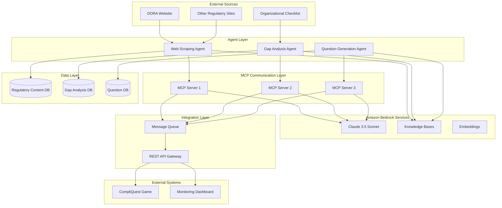
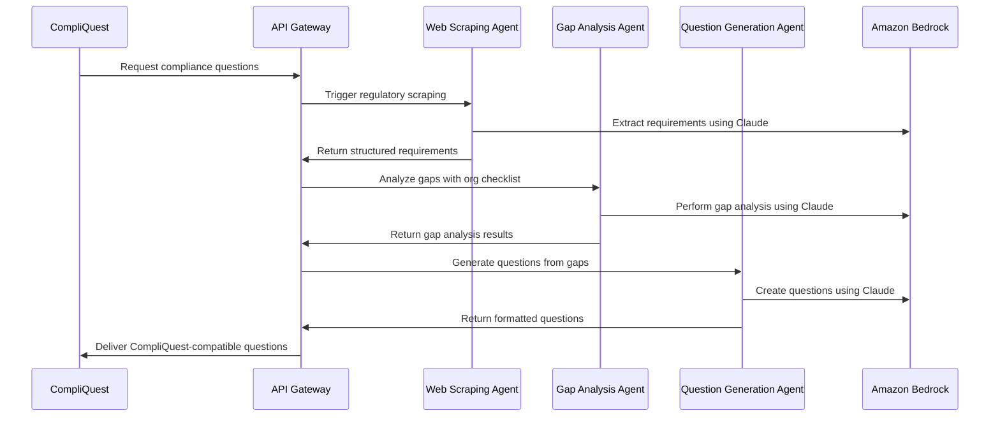
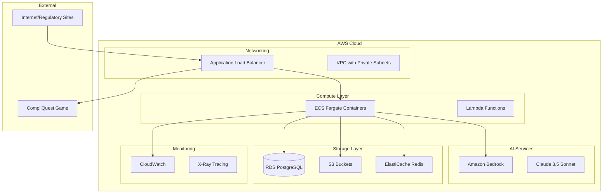
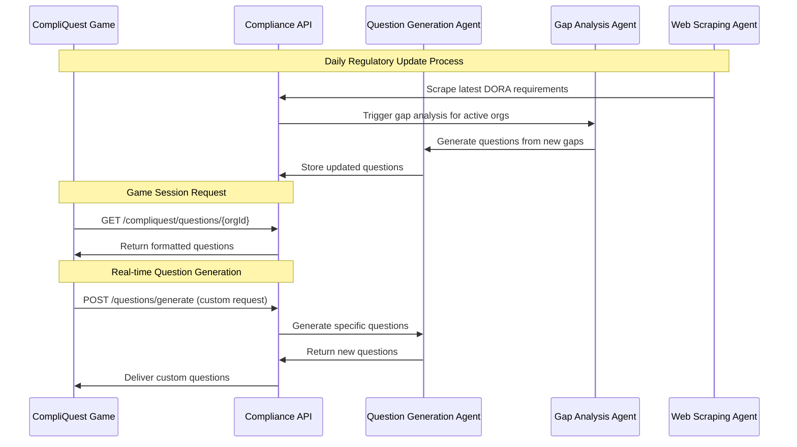

# Regulatory Compliance Agent System - Technical Design

## Overview

The Regulatory Compliance Agent System is a sophisticated multi-agent architecture that automates the process of regulatory compliance assessment by dynamically scraping current regulatory requirements, analyzing compliance gaps, and generating actionable questions for the CompliQuest game platform. The system leverages Amazon Bedrock's AI capabilities to provide intelligent analysis while maintaining extensibility for multiple regulatory frameworks.

### Core Objectives

- **Automated Regulatory Intelligence**: Continuously extract and process regulatory requirements from official sources
- **Intelligent Gap Analysis**: Compare organizational compliance status against current regulatory requirements
- **Dynamic Question Generation**: Transform compliance gaps into engaging, actionable game content
- **Seamless Integration**: Provide CompliQuest-compatible output for immediate game integration
- **Extensible Framework**: Support multiple regulatory frameworks with consistent processing patterns

### Key Capabilities

- Real-time DORA (Digital Operational Resilience Act) content extraction and analysis
- Multi-agent coordination through MCP (Model Context Protocol) servers
- Amazon Bedrock integration with Claude 3.5 Sonnet for natural language processing
- Structured gap analysis with risk severity assessment
- Automated generation of 4 formatted compliance questions per analysis
- Extensible architecture supporting additional regulatory frameworks

## Architecture

### System Architecture Overview

The system follows a distributed multi-agent architecture with three specialized agents coordinated through MCP servers and backed by Amazon Bedrock services.



### Agent Communication Flow



### Deployment Architecture



## Components and Interfaces

### Web Scraping Agent

**Purpose**: Extracts regulatory requirements from official websites with intelligent content parsing and structured data extraction.

**Core Responsibilities**:
- Automated web scraping with rate limiting and retry mechanisms
- Content parsing and requirement extraction using NLP
- Structured data storage with metadata and versioning
- Multi-format support (HTML, PDF, structured data)

**Key Interfaces**:

```typescript
interface WebScrapingAgent {
  scrapeRegulatory(config: ScrapingConfig): Promise<RegulatoryContent>
  parseContent(rawContent: string, format: ContentFormat): Promise<ParsedRequirements>
  validateExtraction(content: RegulatoryContent): ValidationResult
  schedulePeriodicScraping(schedule: CronSchedule): void
}

interface ScrapingConfig {
  targetUrl: string
  framework: RegulatoryFramework
  selectors: ContentSelectors
  rateLimit: RateLimitConfig
  retryPolicy: RetryPolicy
}

interface RegulatoryContent {
  id: string
  framework: RegulatoryFramework
  sourceUrl: string
  extractedAt: Date
  requirements: Requirement[]
  metadata: ContentMetadata
}

interface Requirement {
  id: string
  sectionNumber: string
  title: string
  description: string
  category: RequirementCategory
  deadline?: Date
  severity: SeverityLevel
}
```

**Amazon Bedrock Integration**:
- Uses Claude 3.5 Sonnet for intelligent content extraction and requirement identification
- Leverages embeddings for content similarity detection and deduplication
- Utilizes knowledge bases for storing and retrieving regulatory content

### Gap Analysis Agent

**Purpose**: Compares organizational compliance status against regulatory requirements to identify gaps and assess risk levels.

**Core Responsibilities**:
- Requirement-to-control mapping and analysis
- Gap identification with severity assessment
- Compliance percentage calculation
- Remediation recommendation generation

**Key Interfaces**:

```typescript
interface GapAnalysisAgent {
  analyzeCompliance(requirements: Requirement[], checklist: OrganizationalChecklist): Promise<GapAnalysis>
  calculateComplianceScore(analysis: GapAnalysis): ComplianceScore
  generateRecommendations(gaps: ComplianceGap[]): Recommendation[]
  prioritizeGaps(gaps: ComplianceGap[]): PrioritizedGap[]
}

interface OrganizationalChecklist {
  organizationId: string
  framework: RegulatoryFramework
  controls: Control[]
  lastUpdated: Date
  completionStatus: CompletionStatus
}

interface Control {
  id: string
  name: string
  description: string
  implementationStatus: ImplementationStatus
  evidence?: string[]
  lastReviewed?: Date
}

interface GapAnalysis {
  id: string
  organizationId: string
  framework: RegulatoryFramework
  analysisDate: Date
  gaps: ComplianceGap[]
  complianceScore: ComplianceScore
  recommendations: Recommendation[]
}

interface ComplianceGap {
  requirementId: string
  controlId?: string
  gapType: GapType
  severity: SeverityLevel
  description: string
  impact: string
  effort: EffortLevel
}
```

**Analysis Algorithms**:
- **Requirement Mapping**: Uses semantic similarity to match requirements with organizational controls
- **Gap Classification**: Categorizes gaps as Missing, Partial, or Non-Compliant
- **Risk Assessment**: Applies weighted scoring based on regulatory importance and organizational impact
- **Prioritization**: Ranks gaps using severity, effort, and business impact matrices

### Question Generation Agent

**Purpose**: Transforms gap analysis results into engaging, actionable compliance questions formatted for CompliQuest integration.

**Core Responsibilities**:
- Gap-to-question transformation with prioritization
- CompliQuest format compliance and validation
- Metadata enrichment with remediation guidance
- Quality assurance and content validation

**Key Interfaces**:

```typescript
interface QuestionGenerationAgent {
  generateQuestions(gapAnalysis: GapAnalysis): Promise<ComplianceQuestion[]>
  formatForCompliQuest(questions: ComplianceQuestion[]): CompliQuestQuestion[]
  validateQuestions(questions: ComplianceQuestion[]): ValidationResult[]
  enrichWithMetadata(questions: ComplianceQuestion[]): EnrichedQuestion[]
}

interface ComplianceQuestion {
  id: string
  gapId: string
  questionText: string
  questionType: QuestionType
  answerOptions: AnswerOption[]
  correctAnswer: string
  explanation: string
  remediationGuidance: RemediationGuidance
  difficulty: DifficultyLevel
  category: string
}

interface CompliQuestQuestion {
  id: string
  text: string
  type: 'multiple-choice' | 'true-false' | 'scenario'
  options: string[]
  correctAnswer: number
  points: number
  category: string
  difficulty: 'easy' | 'medium' | 'hard'
  metadata: {
    framework: string
    requirementId: string
    gapSeverity: string
    remediationLinks: string[]
  }
}

interface RemediationGuidance {
  steps: string[]
  resources: Resource[]
  estimatedEffort: string
  priority: PriorityLevel
}
```

**Question Generation Strategies**:
- **Gap Prioritization**: Focuses on High and Medium severity gaps first
- **Question Variety**: Generates different question types (scenario-based, multiple choice, true/false)
- **Actionability**: Ensures questions lead to measurable compliance improvements
- **Engagement**: Incorporates gamification elements and clear success criteria

### MCP Server Communication

**Purpose**: Enables secure, standardized communication between agents using the Model Context Protocol.

**Architecture**:

```typescript
interface MCPServer {
  agentId: string
  capabilities: AgentCapability[]
  messageHandlers: Map<MessageType, MessageHandler>
  
  sendMessage(targetAgent: string, message: MCPMessage): Promise<MCPResponse>
  registerHandler(messageType: MessageType, handler: MessageHandler): void
  broadcastStatus(status: AgentStatus): void
}

interface MCPMessage {
  id: string
  type: MessageType
  sourceAgent: string
  targetAgent: string
  payload: any
  timestamp: Date
  correlationId?: string
}

interface AgentCapability {
  name: string
  version: string
  inputTypes: string[]
  outputTypes: string[]
  dependencies: string[]
}
```

**Communication Patterns**:
- **Request-Response**: Synchronous communication for immediate data needs
- **Event-Driven**: Asynchronous notifications for status updates and completions
- **Pipeline**: Sequential processing through multiple agents
- **Broadcast**: Status updates and health checks across all agents

## Data Models

### Core Domain Models

```typescript
// Regulatory Framework Model
interface RegulatoryFramework {
  id: string
  name: string
  version: string
  description: string
  jurisdiction: string
  effectiveDate: Date
  lastUpdated: Date
  categories: FrameworkCategory[]
  scrapingConfig: ScrapingConfiguration
}

// Requirement Model
interface Requirement {
  id: string
  frameworkId: string
  sectionNumber: string
  title: string
  description: string
  category: RequirementCategory
  subcategory?: string
  mandatory: boolean
  deadline?: Date
  severity: SeverityLevel
  keywords: string[]
  relatedRequirements: string[]
}

// Organizational Control Model
interface OrganizationalControl {
  id: string
  organizationId: string
  name: string
  description: string
  category: ControlCategory
  implementationStatus: ImplementationStatus
  maturityLevel: MaturityLevel
  evidence: Evidence[]
  owner: string
  lastReviewed: Date
  nextReview: Date
}

// Gap Analysis Model
interface ComplianceGap {
  id: string
  requirementId: string
  controlId?: string
  organizationId: string
  gapType: GapType
  severity: SeverityLevel
  description: string
  businessImpact: string
  technicalImpact: string
  estimatedEffort: EffortEstimate
  recommendedActions: string[]
  identifiedAt: Date
  status: GapStatus
}

// Question Model
interface GeneratedQuestion {
  id: string
  gapId: string
  frameworkId: string
  questionText: string
  questionType: QuestionType
  answerOptions: AnswerOption[]
  correctAnswerIndex: number
  explanation: string
  difficulty: DifficultyLevel
  points: number
  category: string
  tags: string[]
  remediationGuidance: RemediationGuidance
  compliQuestMetadata: CompliQuestMetadata
}
```

### Enumeration Types

```typescript
enum RegulatoryFramework {
  DORA = 'DORA',
  GDPR = 'GDPR',
  HIPAA = 'HIPAA',
  PCI_DSS = 'PCI_DSS',
  ISO_27001 = 'ISO_27001',
  SOX = 'SOX'
}

enum SeverityLevel {
  CRITICAL = 'CRITICAL',
  HIGH = 'HIGH',
  MEDIUM = 'MEDIUM',
  LOW = 'LOW'
}

enum ImplementationStatus {
  NOT_IMPLEMENTED = 'NOT_IMPLEMENTED',
  PARTIALLY_IMPLEMENTED = 'PARTIALLY_IMPLEMENTED',
  FULLY_IMPLEMENTED = 'FULLY_IMPLEMENTED',
  NOT_APPLICABLE = 'NOT_APPLICABLE'
}

enum GapType {
  MISSING_CONTROL = 'MISSING_CONTROL',
  INADEQUATE_IMPLEMENTATION = 'INADEQUATE_IMPLEMENTATION',
  OUTDATED_CONTROL = 'OUTDATED_CONTROL',
  INSUFFICIENT_EVIDENCE = 'INSUFFICIENT_EVIDENCE'
}

enum QuestionType {
  MULTIPLE_CHOICE = 'MULTIPLE_CHOICE',
  TRUE_FALSE = 'TRUE_FALSE',
  SCENARIO_BASED = 'SCENARIO_BASED',
  RANKING = 'RANKING'
}
```

### Database Schema

```sql
-- Regulatory Frameworks
CREATE TABLE regulatory_frameworks (
    id UUID PRIMARY KEY,
    name VARCHAR(255) NOT NULL,
    version VARCHAR(50),
    description TEXT,
    jurisdiction VARCHAR(100),
    effective_date DATE,
    last_updated TIMESTAMP DEFAULT CURRENT_TIMESTAMP,
    scraping_config JSONB,
    created_at TIMESTAMP DEFAULT CURRENT_TIMESTAMP
);

-- Requirements
CREATE TABLE requirements (
    id UUID PRIMARY KEY,
    framework_id UUID REFERENCES regulatory_frameworks(id),
    section_number VARCHAR(50),
    title VARCHAR(500) NOT NULL,
    description TEXT,
    category VARCHAR(100),
    subcategory VARCHAR(100),
    mandatory BOOLEAN DEFAULT true,
    deadline DATE,
    severity VARCHAR(20),
    keywords TEXT[],
    related_requirements UUID[],
    created_at TIMESTAMP DEFAULT CURRENT_TIMESTAMP,
    updated_at TIMESTAMP DEFAULT CURRENT_TIMESTAMP
);

-- Organizations
CREATE TABLE organizations (
    id UUID PRIMARY KEY,
    name VARCHAR(255) NOT NULL,
    industry VARCHAR(100),
    size VARCHAR(50),
    jurisdiction VARCHAR(100),
    created_at TIMESTAMP DEFAULT CURRENT_TIMESTAMP
);

-- Organizational Controls
CREATE TABLE organizational_controls (
    id UUID PRIMARY KEY,
    organization_id UUID REFERENCES organizations(id),
    name VARCHAR(255) NOT NULL,
    description TEXT,
    category VARCHAR(100),
    implementation_status VARCHAR(50),
    maturity_level VARCHAR(50),
    owner VARCHAR(255),
    last_reviewed DATE,
    next_review DATE,
    evidence JSONB,
    created_at TIMESTAMP DEFAULT CURRENT_TIMESTAMP,
    updated_at TIMESTAMP DEFAULT CURRENT_TIMESTAMP
);

-- Gap Analyses
CREATE TABLE gap_analyses (
    id UUID PRIMARY KEY,
    organization_id UUID REFERENCES organizations(id),
    framework_id UUID REFERENCES regulatory_frameworks(id),
    analysis_date TIMESTAMP DEFAULT CURRENT_TIMESTAMP,
    compliance_score DECIMAL(5,2),
    total_requirements INTEGER,
    compliant_requirements INTEGER,
    gaps_identified INTEGER,
    status VARCHAR(50),
    created_at TIMESTAMP DEFAULT CURRENT_TIMESTAMP
);

-- Compliance Gaps
CREATE TABLE compliance_gaps (
    id UUID PRIMARY KEY,
    gap_analysis_id UUID REFERENCES gap_analyses(id),
    requirement_id UUID REFERENCES requirements(id),
    control_id UUID REFERENCES organizational_controls(id),
    gap_type VARCHAR(50),
    severity VARCHAR(20),
    description TEXT,
    business_impact TEXT,
    technical_impact TEXT,
    estimated_effort JSONB,
    recommended_actions TEXT[],
    status VARCHAR(50),
    created_at TIMESTAMP DEFAULT CURRENT_TIMESTAMP,
    updated_at TIMESTAMP DEFAULT CURRENT_TIMESTAMP
);

-- Generated Questions
CREATE TABLE generated_questions (
    id UUID PRIMARY KEY,
    gap_id UUID REFERENCES compliance_gaps(id),
    framework_id UUID REFERENCES regulatory_frameworks(id),
    question_text TEXT NOT NULL,
    question_type VARCHAR(50),
    answer_options JSONB,
    correct_answer_index INTEGER,
    explanation TEXT,
    difficulty VARCHAR(20),
    points INTEGER,
    category VARCHAR(100),
    tags TEXT[],
    remediation_guidance JSONB,
    compliquest_metadata JSONB,
    created_at TIMESTAMP DEFAULT CURRENT_TIMESTAMP,
    updated_at TIMESTAMP DEFAULT CURRENT_TIMESTAMP
);

-- Scraping Sessions
CREATE TABLE scraping_sessions (
    id UUID PRIMARY KEY,
    framework_id UUID REFERENCES regulatory_frameworks(id),
    source_url VARCHAR(1000),
    started_at TIMESTAMP DEFAULT CURRENT_TIMESTAMP,
    completed_at TIMESTAMP,
    status VARCHAR(50),
    requirements_extracted INTEGER,
    errors JSONB,
    metadata JSONB
);
```

### API Specifications

#### REST API Endpoints

```typescript
// Framework Management
GET    /api/v1/frameworks
POST   /api/v1/frameworks
GET    /api/v1/frameworks/{id}
PUT    /api/v1/frameworks/{id}
DELETE /api/v1/frameworks/{id}

// Scraping Operations
POST   /api/v1/scraping/trigger
GET    /api/v1/scraping/sessions
GET    /api/v1/scraping/sessions/{id}
GET    /api/v1/scraping/status/{frameworkId}

// Gap Analysis
POST   /api/v1/analysis/gaps
GET    /api/v1/analysis/gaps/{organizationId}
GET    /api/v1/analysis/gaps/{organizationId}/{frameworkId}
PUT    /api/v1/analysis/gaps/{id}

// Question Generation
POST   /api/v1/questions/generate
GET    /api/v1/questions/compliquest/{organizationId}
GET    /api/v1/questions/{id}
PUT    /api/v1/questions/{id}/approve

// CompliQuest Integration
GET    /api/v1/compliquest/questions/{organizationId}
POST   /api/v1/compliquest/questions/batch
GET    /api/v1/compliquest/questions/preview/{gapAnalysisId}
```

#### API Request/Response Models

```typescript
// Trigger Scraping Request
interface TriggerScrapingRequest {
  frameworkId: string
  sourceUrl?: string
  forceRefresh?: boolean
  notificationWebhook?: string
}

interface TriggerScrapingResponse {
  sessionId: string
  status: 'started' | 'queued'
  estimatedCompletion: Date
}

// Generate Questions Request
interface GenerateQuestionsRequest {
  gapAnalysisId: string
  questionCount?: number
  difficultyLevels?: DifficultyLevel[]
  categories?: string[]
  prioritizeHighSeverity?: boolean
}

interface GenerateQuestionsResponse {
  questions: CompliQuestQuestion[]
  metadata: {
    gapAnalysisId: string
    generatedAt: Date
    totalGapsAnalyzed: number
    questionsGenerated: number
  }
}

// CompliQuest Questions Response
interface CompliQuestQuestionsResponse {
  questions: CompliQuestQuestion[]
  metadata: {
    organizationId: string
    framework: string
    lastUpdated: Date
    totalQuestions: number
    averageDifficulty: string
  }
}
```

## Integration Patterns

### CompliQuest Game Integration

The system provides seamless integration with the CompliQuest game through standardized APIs and data formats.

**Integration Flow**:



**Data Format Compatibility**:

```typescript
// CompliQuest Expected Format
interface CompliQuestQuestion {
  id: string
  text: string
  type: 'multiple-choice' | 'true-false' | 'scenario'
  options: string[]
  correctAnswer: number
  points: number
  category: string
  difficulty: 'easy' | 'medium' | 'hard'
  metadata: {
    framework: string
    requirementId: string
    gapSeverity: string
    remediationLinks: string[]
    achievements?: string[]
    prerequisites?: string[]
  }
}

// Transformation Logic
class CompliQuestAdapter {
  transformQuestion(question: GeneratedQuestion): CompliQuestQuestion {
    return {
      id: question.id,
      text: question.questionText,
      type: this.mapQuestionType(question.questionType),
      options: question.answerOptions.map(opt => opt.text),
      correctAnswer: question.correctAnswerIndex,
      points: this.calculatePoints(question.difficulty, question.gapSeverity),
      category: question.category,
      difficulty: this.mapDifficulty(question.difficulty),
      metadata: {
        framework: question.frameworkId,
        requirementId: question.gapId,
        gapSeverity: question.severity,
        remediationLinks: question.remediationGuidance.resources.map(r => r.url),
        achievements: this.generateAchievements(question),
        prerequisites: this.identifyPrerequisites(question)
      }
    }
  }
}
```

### Amazon Bedrock Integration Patterns

**Claude 3.5 Sonnet Integration**:

```typescript
class BedrockIntegration {
  private client: BedrockRuntimeClient
  
  async extractRequirements(content: string, framework: string): Promise<Requirement[]> {
    const prompt = `
    Extract regulatory requirements from the following ${framework} content.
    Focus on actionable compliance requirements with clear obligations.
    
    Content: ${content}
    
    Return structured JSON with: id, title, description, category, mandatory, severity
    `
    
    const response = await this.client.send(new InvokeModelCommand({
      modelId: 'anthropic.claude-3-5-sonnet-20241022-v2:0',
      body: JSON.stringify({
        anthropic_version: 'bedrock-2023-05-31',
        messages: [{ role: 'user', content: prompt }],
        max_tokens: 4000,
        temperature: 0.1
      })
    }))
    
    return this.parseRequirements(response.body)
  }
  
  async analyzeGaps(requirements: Requirement[], controls: Control[]): Promise<ComplianceGap[]> {
    const prompt = `
    Analyze compliance gaps between regulatory requirements and organizational controls.
    
    Requirements: ${JSON.stringify(requirements)}
    Controls: ${JSON.stringify(controls)}
    
    Identify gaps, assess severity, and provide remediation recommendations.
    `
    
    // Similar Bedrock invocation pattern
  }
  
  async generateQuestions(gaps: ComplianceGap[]): Promise<ComplianceQuestion[]> {
    const prompt = `
    Generate 4 engaging compliance questions from the following gaps.
    Focus on actionable scenarios that help users understand and address compliance requirements.
    
    Gaps: ${JSON.stringify(gaps)}
    
    Format: Multiple choice questions with clear explanations and remediation guidance.
    `
    
    // Similar Bedrock invocation pattern
  }
}
```

**Knowledge Base Integration**:

```typescript
class KnowledgeBaseManager {
  async storeRegulatoryContent(content: RegulatoryContent): Promise<void> {
    // Store in Bedrock Knowledge Base for semantic search
    await this.bedrockKB.indexDocument({
      dataSourceId: content.framework,
      document: {
        id: content.id,
        title: content.title,
        content: content.description,
        metadata: {
          framework: content.framework,
          category: content.category,
          severity: content.severity,
          lastUpdated: content.extractedAt
        }
      }
    })
  }
  
  async findSimilarRequirements(query: string, framework: string): Promise<Requirement[]> {
    const response = await this.bedrockKB.retrieve({
      knowledgeBaseId: this.getKnowledgeBaseId(framework),
      retrievalQuery: { text: query },
      retrievalConfiguration: {
        vectorSearchConfiguration: {
          numberOfResults: 10,
          overrideSearchType: 'HYBRID'
        }
      }
    })
    
    return response.retrievalResults.map(result => this.parseRequirement(result))
  }
}
```

### Error Handling and Resilience Patterns

**Circuit Breaker Pattern**:

```typescript
class CircuitBreaker {
  private failures = 0
  private lastFailureTime = 0
  private state: 'CLOSED' | 'OPEN' | 'HALF_OPEN' = 'CLOSED'
  
  async execute<T>(operation: () => Promise<T>): Promise<T> {
    if (this.state === 'OPEN') {
      if (Date.now() - this.lastFailureTime > this.timeout) {
        this.state = 'HALF_OPEN'
      } else {
        throw new Error('Circuit breaker is OPEN')
      }
    }
    
    try {
      const result = await operation()
      this.onSuccess()
      return result
    } catch (error) {
      this.onFailure()
      throw error
    }
  }
  
  private onSuccess(): void {
    this.failures = 0
    this.state = 'CLOSED'
  }
  
  private onFailure(): void {
    this.failures++
    this.lastFailureTime = Date.now()
    
    if (this.failures >= this.threshold) {
      this.state = 'OPEN'
    }
  }
}
```

**Retry with Exponential Backoff**:

```typescript
class RetryHandler {
  async executeWithRetry<T>(
    operation: () => Promise<T>,
    maxRetries = 3,
    baseDelay = 1000
  ): Promise<T> {
    let lastError: Error
    
    for (let attempt = 0; attempt <= maxRetries; attempt++) {
      try {
        return await operation()
      } catch (error) {
        lastError = error
        
        if (attempt === maxRetries) {
          break
        }
        
        const delay = baseDelay * Math.pow(2, attempt)
        await this.sleep(delay + Math.random() * 1000) // Add jitter
      }
    }
    
    throw lastError
  }
  
  private sleep(ms: number): Promise<void> {
    return new Promise(resolve => setTimeout(resolve, ms))
  }
}
```

## Correctness Properties

*A property is a characteristic or behavior that should hold true across all valid executions of a system-essentially, a formal statement about what the system should do. Properties serve as the bridge between human-readable specifications and machine-verifiable correctness guarantees.*

After analyzing the acceptance criteria, I've identified several properties that can be consolidated to eliminate redundancy while maintaining comprehensive coverage:

**Property Reflection Analysis:**
- Properties 1.1, 1.2, 5.2-5.7 all relate to content extraction and can be consolidated into comprehensive extraction properties
- Properties 2.1, 2.2, 2.3 all relate to gap analysis core functionality and can be combined
- Properties 3.1, 3.2, 3.6, 7.1, 7.2 all relate to question generation format and can be consolidated
- Properties 8.1, 8.2, 8.4 all relate to data persistence and can be combined into comprehensive storage properties

### Property 1: Regulatory Content Extraction Completeness

*For any* regulatory website content and framework configuration, when the Web Scraping Agent processes the content, all extractable requirements should be identified and stored with complete metadata including source URL, extraction timestamp, section numbers, and compliance deadlines.

**Validates: Requirements 1.1, 1.2, 1.3, 1.4, 5.2, 5.3, 5.4, 5.5, 5.6**

### Property 2: Content Validation and Error Detection

*For any* extracted regulatory content, the Web Scraping Agent should validate completeness and flag parsing errors, ensuring that malformed or incomplete content is properly identified and reported.

**Validates: Requirements 1.6**

### Property 3: Framework-Independent Processing

*For any* set of multiple regulatory frameworks processed concurrently, each framework should be processed independently without interference, and the system should support different content formats (HTML, PDF, structured data) consistently.

**Validates: Requirements 1.7, 6.4**

### Property 4: Retry and Rate Limiting Behavior

*For any* website access failure or rate limiting scenario, the Web Scraping Agent should implement appropriate retry mechanisms with exponential backoff and respect rate limits to ensure reliable content extraction.

**Validates: Requirements 1.5, 4.7**

### Property 5: Comprehensive Gap Analysis

*For any* set of regulatory requirements and organizational checklist, the Gap Analysis Agent should compare each requirement against implementation status, correctly classify gaps as missing/partial/compliant, assign consistent risk severity levels, and generate structured recommendations for each identified gap.

**Validates: Requirements 2.1, 2.2, 2.3, 2.5**

### Property 6: Compliance Score Calculation Accuracy

*For any* completed gap analysis, the calculated compliance percentage should accurately reflect the ratio of compliant requirements to total requirements, and incomplete organizational data should be properly flagged with requests for additional details.

**Validates: Requirements 2.6, 2.7**

### Property 7: DORA-Specific Analysis Focus

*For any* DORA framework analysis, the Gap Analysis Agent should prioritize operational resilience controls including ICT risk management, incident reporting, and third-party risk management in the analysis and recommendations.

**Validates: Requirements 2.4**

### Property 8: Question Generation Quantity and Format Compliance

*For any* gap analysis results, the Question Generation Agent should generate exactly 4 questions formatted according to CompliQuest schema with all required metadata including difficulty level, category, point values, and remediation guidance.

**Validates: Requirements 3.1, 3.2, 3.4, 3.6, 7.1, 7.2**

### Property 9: Gap Prioritization in Question Selection

*For any* gap analysis with mixed severity levels, the Question Generation Agent should prioritize High and Medium severity gaps when selecting which gaps to convert into questions, falling back to partially compliant areas only when insufficient high-priority gaps exist.

**Validates: Requirements 3.3, 3.7**

### Property 10: Multilingual Content Processing

*For any* DORA content provided in different official EU languages, the Web Scraping Agent should extract equivalent requirements consistently across languages, ensuring that multilingual processing doesn't affect extraction accuracy.

**Validates: Requirements 5.7**

### Property 11: Service Failure Resilience

*For any* Amazon AI service failure or unavailability, the system should implement proper error handling, queue requests for retry, and preserve partial results to enable recovery without data loss.

**Validates: Requirements 4.6, 10.6**

### Property 12: Framework Selection and Workflow Management

*For any* user framework selection and question approval workflow, the system should correctly process the selected framework and maintain proper question versioning when regulatory requirements change over time.

**Validates: Requirements 6.7, 7.5, 7.6**

### Property 13: External Resource Validation

*For any* generated questions containing external resource links, the system should validate that links are accessible and current before including them in question metadata.

**Validates: Requirements 7.7**

### Property 14: Comprehensive Data Storage and Audit Trail

*For any* system operation including scraping, analysis, and question generation, all activities should be logged with complete audit trails, and all stored content should include proper source attribution and timestamps with version history tracking.

**Validates: Requirements 8.1, 8.2, 8.4**

### Property 15: Data Lifecycle Management

*For any* data storage scenario approaching capacity limits, the system should automatically implement archiving procedures for older content while maintaining data retention policies for active content.

**Validates: Requirements 8.3, 8.7**

### Property 16: Concurrent Processing Capability

*For any* multiple regulatory frameworks or analysis requests processed simultaneously, the system should handle concurrent operations without interference and implement appropriate caching to avoid redundant processing of unchanged content.

**Validates: Requirements 9.4, 9.5**

### Property 17: Progress Reporting for Long Operations

*For any* processing operation that exceeds expected time limits, the system should provide regular progress updates and estimated completion times to maintain user awareness of system status.

**Validates: Requirements 9.7**

### Property 18: Comprehensive System Logging

*For any* agent activity or system operation, comprehensive logs should be generated that capture all relevant details for monitoring, debugging, and audit purposes.

**Validates: Requirements 10.1**

### Property 19: Failure Detection and Alerting

*For any* scraping failure due to website changes or other issues, the system should detect the failure, alert administrators, and provide sufficient diagnostic information for troubleshooting.

**Validates: Requirements 10.3**

### Property 20: Circuit Breaker Protection

*For any* external service dependency failure, circuit breaker patterns should properly protect the system against cascading failures by opening circuits when failure thresholds are exceeded and allowing recovery when services become available.

**Validates: Requirements 10.4**

## Error Handling

### Error Classification and Response Strategies

The system implements comprehensive error handling across multiple layers to ensure resilience and reliability:

#### Web Scraping Agent Error Handling

**Content Access Errors**:
- **HTTP Errors (4xx/5xx)**: Implement exponential backoff retry with circuit breaker protection
- **Rate Limiting**: Respect rate limits with intelligent backoff and request queuing
- **Content Changes**: Detect structural changes in target websites and alert administrators
- **Network Timeouts**: Configure appropriate timeouts with retry mechanisms

**Content Processing Errors**:
- **Malformed HTML/PDF**: Graceful degradation with partial content extraction
- **Missing Required Elements**: Flag incomplete extractions and request manual review
- **Encoding Issues**: Implement robust character encoding detection and conversion
- **Large Content**: Stream processing for large documents with progress tracking

#### Gap Analysis Agent Error Handling

**Data Validation Errors**:
- **Incomplete Checklists**: Identify missing controls and request additional information
- **Invalid Requirements**: Flag malformed requirement data and skip processing
- **Mapping Failures**: Handle cases where requirements cannot be mapped to controls
- **Calculation Errors**: Validate compliance score calculations and flag anomalies

**Processing Errors**:
- **Memory Constraints**: Implement batch processing for large datasets
- **Timeout Handling**: Break large analyses into smaller chunks with progress tracking
- **Concurrent Access**: Handle database conflicts with optimistic locking

#### Question Generation Agent Error Handling

**Generation Errors**:
- **Insufficient Gaps**: Generate questions from partially compliant areas when needed
- **Schema Validation**: Ensure all questions pass CompliQuest schema validation
- **Content Quality**: Implement quality checks for question clarity and actionability
- **Metadata Completeness**: Validate that all required metadata is present

**Integration Errors**:
- **API Failures**: Queue questions for later delivery if CompliQuest API is unavailable
- **Format Conversion**: Handle edge cases in CompliQuest format transformation
- **Version Conflicts**: Manage question versioning when requirements change

#### Amazon Bedrock Integration Error Handling

**Service Availability**:
- **Model Unavailability**: Implement fallback to cached responses or alternative models
- **Rate Limiting**: Respect Bedrock service limits with intelligent request queuing
- **Token Limits**: Handle context length limits with content chunking strategies
- **Authentication Errors**: Implement credential refresh and rotation mechanisms

**Response Quality**:
- **Malformed Responses**: Validate AI responses and request regeneration if needed
- **Incomplete Extractions**: Detect partial responses and request completion
- **Hallucination Detection**: Implement validation checks against source content

### Error Recovery Patterns

#### Graceful Degradation

```typescript
class GracefulDegradationHandler {
  async processWithFallback<T>(
    primaryOperation: () => Promise<T>,
    fallbackOperation: () => Promise<T>,
    degradedOperation: () => Promise<Partial<T>>
  ): Promise<T | Partial<T>> {
    try {
      return await primaryOperation()
    } catch (primaryError) {
      this.logger.warn('Primary operation failed, trying fallback', primaryError)
      
      try {
        return await fallbackOperation()
      } catch (fallbackError) {
        this.logger.warn('Fallback failed, using degraded mode', fallbackError)
        return await degradedOperation()
      }
    }
  }
}
```

#### Partial Result Preservation

```typescript
class PartialResultManager {
  async savePartialResults(
    operationId: string,
    partialData: any,
    completionPercentage: number
  ): Promise<void> {
    await this.storage.savePartialResult({
      operationId,
      data: partialData,
      completionPercentage,
      timestamp: new Date(),
      resumable: true
    })
  }
  
  async resumeOperation(operationId: string): Promise<any> {
    const partialResult = await this.storage.getPartialResult(operationId)
    if (partialResult && partialResult.resumable) {
      return this.continueFromPartial(partialResult)
    }
    throw new Error('Operation cannot be resumed')
  }
}
```

#### Dead Letter Queue Pattern

```typescript
class DeadLetterQueueHandler {
  async handleFailedMessage(
    message: ProcessingMessage,
    error: Error,
    attemptCount: number
  ): Promise<void> {
    if (attemptCount >= this.maxRetries) {
      await this.deadLetterQueue.send({
        originalMessage: message,
        error: error.message,
        failedAt: new Date(),
        attemptCount
      })
      
      await this.notificationService.alertAdministrators({
        type: 'DEAD_LETTER_QUEUE',
        message: `Message failed after ${attemptCount} attempts`,
        details: { messageId: message.id, error: error.message }
      })
    } else {
      // Schedule retry with exponential backoff
      const delay = Math.pow(2, attemptCount) * 1000
      await this.scheduleRetry(message, delay)
    }
  }
}
```

## Testing Strategy

### Dual Testing Approach

The system employs a comprehensive testing strategy that combines unit testing for specific scenarios with property-based testing for universal correctness guarantees. This dual approach ensures both concrete functionality validation and broad input coverage.

#### Unit Testing Strategy

**Focused Areas for Unit Tests**:
- **Integration Points**: API endpoints, database connections, external service integrations
- **Edge Cases**: Empty content, malformed data, boundary conditions
- **Error Conditions**: Service failures, network timeouts, invalid inputs
- **Specific Examples**: Known regulatory content samples, predefined gap scenarios

**Unit Test Examples**:
```typescript
describe('Web Scraping Agent', () => {
  it('should handle empty DORA content gracefully', async () => {
    const emptyContent = ''
    const result = await webScrapingAgent.parseContent(emptyContent, 'HTML')
    expect(result.requirements).toEqual([])
    expect(result.errors).toContain('EMPTY_CONTENT')
  })
  
  it('should extract specific DORA article requirements', async () => {
    const doraArticle = loadTestContent('dora-article-5.html')
    const result = await webScrapingAgent.parseContent(doraArticle, 'HTML')
    expect(result.requirements).toHaveLength(3)
    expect(result.requirements[0].category).toBe('ICT_RISK_MANAGEMENT')
  })
})
```

#### Property-Based Testing Strategy

**Property Test Configuration**:
- **Testing Library**: fast-check for TypeScript/JavaScript
- **Minimum Iterations**: 100 per property test
- **Shrinking**: Enabled for minimal failing examples
- **Seeded Randomization**: Reproducible test runs

**Property Test Implementation**:

```typescript
import fc from 'fast-check'

describe('Property Tests - Regulatory Compliance System', () => {
  
  // Property 1: Regulatory Content Extraction Completeness
  it('should extract complete metadata for any regulatory content', async () => {
    await fc.assert(fc.asyncProperty(
      fc.record({
        content: fc.string({ minLength: 100 }),
        framework: fc.constantFrom('DORA', 'GDPR', 'HIPAA'),
        sourceUrl: fc.webUrl()
      }),
      async ({ content, framework, sourceUrl }) => {
        const config = { targetUrl: sourceUrl, framework }
        const result = await webScrapingAgent.scrapeRegulatory(config)
        
        // All extracted content must have complete metadata
        expect(result.sourceUrl).toBe(sourceUrl)
        expect(result.framework).toBe(framework)
        expect(result.extractedAt).toBeInstanceOf(Date)
        expect(result.metadata).toBeDefined()
        
        // All requirements must have required fields
        result.requirements.forEach(req => {
          expect(req.id).toBeTruthy()
          expect(req.title).toBeTruthy()
          expect(req.description).toBeTruthy()
          expect(req.category).toBeTruthy()
        })
      }
    ), { numRuns: 100 })
  })
  
  // Property 8: Question Generation Quantity and Format Compliance
  it('should generate exactly 4 CompliQuest-compatible questions for any gap analysis', async () => {
    await fc.assert(fc.asyncProperty(
      fc.array(fc.record({
        id: fc.uuid(),
        severity: fc.constantFrom('HIGH', 'MEDIUM', 'LOW'),
        description: fc.string({ minLength: 10 }),
        requirementId: fc.uuid()
      }), { minLength: 1, maxLength: 20 }),
      async (gaps) => {
        const gapAnalysis = { id: fc.uuid(), gaps, analysisDate: new Date() }
        const questions = await questionGenerationAgent.generateQuestions(gapAnalysis)
        
        // Must generate exactly 4 questions
        expect(questions).toHaveLength(4)
        
        // All questions must be CompliQuest compatible
        questions.forEach(question => {
          expect(question.questionText).toBeTruthy()
          expect(question.answerOptions).toHaveLength.greaterThan(1)
          expect(question.correctAnswerIndex).toBeGreaterThanOrEqual(0)
          expect(question.correctAnswerIndex).toBeLessThan(question.answerOptions.length)
          expect(question.difficulty).toMatch(/^(easy|medium|hard)$/)
          expect(question.points).toBeGreaterThan(0)
          expect(question.remediationGuidance).toBeDefined()
        })
      }
    ), { numRuns: 100 })
  })
  
  // Property 5: Comprehensive Gap Analysis
  it('should classify all gaps correctly for any requirements and checklist combination', async () => {
    await fc.assert(fc.asyncProperty(
      fc.record({
        requirements: fc.array(fc.record({
          id: fc.uuid(),
          title: fc.string(),
          mandatory: fc.boolean(),
          category: fc.string()
        }), { minLength: 1 }),
        controls: fc.array(fc.record({
          id: fc.uuid(),
          name: fc.string(),
          implementationStatus: fc.constantFrom('NOT_IMPLEMENTED', 'PARTIALLY_IMPLEMENTED', 'FULLY_IMPLEMENTED')
        }), { minLength: 0 })
      }),
      async ({ requirements, controls }) => {
        const checklist = { organizationId: fc.uuid(), controls, framework: 'DORA' }
        const analysis = await gapAnalysisAgent.analyzeCompliance(requirements, checklist)
        
        // All requirements must be analyzed
        expect(analysis.gaps.length + analysis.compliantRequirements.length).toBe(requirements.length)
        
        // All gaps must have valid severity levels
        analysis.gaps.forEach(gap => {
          expect(['CRITICAL', 'HIGH', 'MEDIUM', 'LOW']).toContain(gap.severity)
          expect(gap.gapType).toBeTruthy()
          expect(gap.description).toBeTruthy()
        })
        
        // Compliance score must be between 0 and 100
        expect(analysis.complianceScore.percentage).toBeGreaterThanOrEqual(0)
        expect(analysis.complianceScore.percentage).toBeLessThanOrEqual(100)
      }
    ), { numRuns: 100 })
  })
  
  // Property 16: Concurrent Processing Capability
  it('should handle concurrent framework processing without interference', async () => {
    await fc.assert(fc.asyncProperty(
      fc.array(fc.constantFrom('DORA', 'GDPR', 'HIPAA', 'PCI_DSS'), { minLength: 2, maxLength: 4 }),
      async (frameworks) => {
        const processingPromises = frameworks.map(framework => 
          webScrapingAgent.scrapeRegulatory({ 
            targetUrl: `https://example.com/${framework}`, 
            framework 
          })
        )
        
        const results = await Promise.all(processingPromises)
        
        // Each framework should be processed independently
        expect(results).toHaveLength(frameworks.length)
        
        // Results should match their respective frameworks
        results.forEach((result, index) => {
          expect(result.framework).toBe(frameworks[index])
          expect(result.requirements).toBeDefined()
        })
        
        // No cross-contamination between frameworks
        const allRequirements = results.flatMap(r => r.requirements)
        const frameworkGroups = groupBy(allRequirements, 'framework')
        expect(Object.keys(frameworkGroups)).toEqual(frameworks)
      }
    ), { numRuns: 100 })
  })
})

// Property test tags for traceability
const PROPERTY_TAGS = {
  EXTRACTION_COMPLETENESS: 'Feature: regulatory-compliance-agent-system, Property 1: Regulatory Content Extraction Completeness',
  QUESTION_FORMAT: 'Feature: regulatory-compliance-agent-system, Property 8: Question Generation Quantity and Format Compliance',
  GAP_ANALYSIS: 'Feature: regulatory-compliance-agent-system, Property 5: Comprehensive Gap Analysis',
  CONCURRENT_PROCESSING: 'Feature: regulatory-compliance-agent-system, Property 16: Concurrent Processing Capability'
}
```

#### Integration Testing Strategy

**API Integration Tests**:
- CompliQuest API compatibility validation
- Amazon Bedrock service integration verification
- Database transaction integrity testing
- MCP server communication validation

**End-to-End Testing**:
- Complete workflow testing from scraping to question generation
- Multi-framework processing scenarios
- Error recovery and resilience testing
- Performance validation under load

#### Test Data Management

**Synthetic Data Generation**:
- Regulatory content generators for different frameworks
- Organizational checklist simulators
- Gap analysis scenario builders
- Question validation datasets

**Test Environment Management**:
- Isolated test environments for each agent
- Mock services for external dependencies
- Test data cleanup and reset procedures
- Continuous integration pipeline integration

This comprehensive testing strategy ensures that the regulatory compliance agent system maintains high reliability and correctness across all operational scenarios while providing clear traceability between requirements, properties, and test implementations.